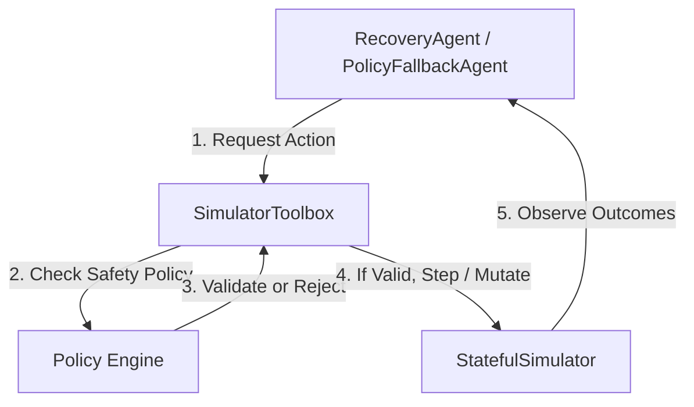

# AI Payment Recovery Agent

This document details the architecture, safety policy layer, provider abstraction, tools interface, and fallback execution logic of the AI Payment Recovery Agent (Phase 4B).

---

## Architecture Overview

The recovery agent interacts with the stateful simulation environment strictly through a typed tool interface, preventing the LLM or fallback controller from directly mutating the simulator's internal state.



---

## 1. Safety Policy Layer (`agent/policy.py`)

A standalone security filter validates all incoming recovery commands before they are dispatched to the simulator:

*   **`MAX_SINGLE_ACTION_TRAFFIC`**: Limits routing, reduction, and rate-limiting actions to a maximum of **50% traffic per single action** (to prevent cascading routing instabilities).
*   **Gateway Target Health Checks**: Rejects routing traffic to any gateway that has active ML-detected incidents or elevated error rates ($>10\%$ failure rate) in the current observation.
*   **Explainability Constraint**: Rejects actions that do not provide a clear, non-empty, detailed `"explanation"` parameter.
*   **Rollback Capability**: Rejects actions that do not have an identical rollback mechanism (all supported actions are reversible).
*   **Dimension Verification**: Rejects actions referencing unknown gateways, banks, methods, or merchants.

---

## 2. Agent Tooling (`agent/tools.py`)

The agent interacts with the environment exclusively via the `SimulatorToolbox`:

*   `inspect_incident()`: Summary of active incidents and top degraded segments.
*   `calculate_revenue_impact()`: Retrieves global success rate, latency, and revenue-at-risk.
*   `list_available_actions()`: Discovers candidate recovery templates matching baseline configurations.
*   `simulate_action(action)`: Performs a **true dry-run simulation** (cloning RNG and action states, running a step on identical baseline transactions, returning projections, and discarding the cloned state).
*   `execute_action(action)`: Executes the validated action, advancing the simulation time by 5 minutes.
*   `observe_result()`: Retrieves current step observation.
*   `rollback_action(action_id)`: Rolls back a previous action and advances simulation.

---

## 3. Heuristic Candidate Ranking & LLM Providers

### Candidate Ranking Formula
Instead of hardcoded maps, actions are ranked dynamically by scoring projected outcomes:
$$\text{Action Score} = (0.5 \times \Delta_{\text{Success}} + 0.5 \times \text{Rev}_{\text{ReducedFraction}}) \times \text{Confidence} \times (1.0 - \text{Risk}) \times \text{Reversibility}$$
*   **Risk multipliers**: `ROUTE_TRAFFIC` (0.1), `REDUCE_GATEWAY_TRAFFIC` (0.2), `RATE_LIMIT_MERCHANT` (0.6), `DISABLE_PAYMENT_METHOD` (0.8).

### LLM Provider Abstraction (`agent/providers.py`)
Provides `LLMProvider.generate(prompt, schema)` wrapper. Under test environments, `MockLLMProvider` matches prompt keywords to return deterministic, structured mock recovery actions.

### Heuristic Fallback Agent (`POLICY_FALLBACK`)
If no LLM API key is present, the agent runs in `POLICY_FALLBACK` mode. It selects the highest-scoring candidate action according to the ranking formula and executes it.

---

## 4. Multi-Step Decision Engine & Control Loop

The agent runs in a bounded loop of up to `max_iterations = 3`. In each iteration:
1.  **Observe**: Retrieves current metrics from `SimulatorToolbox.observe_result()`.
2.  **Evaluate Stop Conditions**:
    -   If no active incidents exist: decisions = `STOP`, status = `NO_INCIDENT`.
    -   If recovery thresholds are met compared to pre-recovery metrics: decisions = `STOP`, status = `RECOVERY_SUCCESSFUL`.
        -   **Success Rate Target**: `RECOVERY_SUCCESS_RATE_TARGET = 90%` (0.90)
        -   **Revenue Risk Reduction Target**: `RECOVERY_REVENUE_RISK_REDUCTION = 50%` reduction.
3.  **Calculate Diagnosis Confidence & Root Cause**:
    -   Calculated using `calculate_diagnosis_confidence(obs)`:
        -   **Anomaly Score Contribution**: `anomaly_score * 0.4`
        -   **Evidence Quality & Volume**: `+0.2` for `HIGH`/`GOOD` quality, `+0.1` for `FAIR`, `+0.05` otherwise. If a known likely pattern is detected, adds another `+0.1`. (Capped at `0.4` max contribution).
        -   **Incident Severity Contribution**: `+0.2` for `HIGH`/`CRITICAL`, `+0.1` for `MEDIUM`, `+0.05` for `LOW`.
        -   **Coverage Penalty**: If baseline data is empty or flagged as `INSUFFICIENT_DATA` (e.g. during a gap), the confidence score is **multiplied by 0.5**.
4.  **Enforce Low-Confidence Pathway**:
    -   If calculated confidence is **below 60%** (`MIN_ACTION_CONFIDENCE = 0.60`):
        -   Rejects aggressive actions.
        -   Filters available candidate actions to **safe, reversible low-impact actions** (parameters specify $\le 25\%$ traffic routing/reduction).
        -   If no low-impact action has a positive score, terminates immediately with `decision = STOP`, `status = LOW_CONFIDENCE`.
5.  **Execute & Transition**:
    -   Selects the highest scoring candidate action.
    -   Executes the action via the toolbox.
    -   If the action is rejected or ineffective (the success rate does not improve), immediately rolls back the action.

---

## 5. Real LLM Providers (`agent/providers.py`)

A dynamic provider factory `get_llm_provider()` reads from environment variables (`LLM_PROVIDER`, `LLM_API_KEY`, `LLM_MODEL`) to spawn providers:
-   **`RealLLMProvider`**: Uses the standard library `urllib` package to execute HTTP POST requests directly to Gemini or OpenAI endpoints. Never uses third-party libraries, maintaining a zero-dependency posture.
-   **`MockLLMProvider`**: Default mockup used for local testing and validation without requiring API credentials.

---

## 6. Running the Gateway Degradation Recovery Demo

A deterministic demo script simulates a complete incident cycle: baseline generation, degradation injection, ML detection, diagnostic evaluation, candidate dry-run routing simulations, action routing, and threshold verification.

### Run Command (No API keys required)
```powershell
backend\.venv\Scripts\python.exe -m agent.demo
```
The script runs in `POLICY_FALLBACK` mode and outputs a complete terminal recovery report detailing the before, candidate simulations, selected action, after metrics, and final recovery decision.
