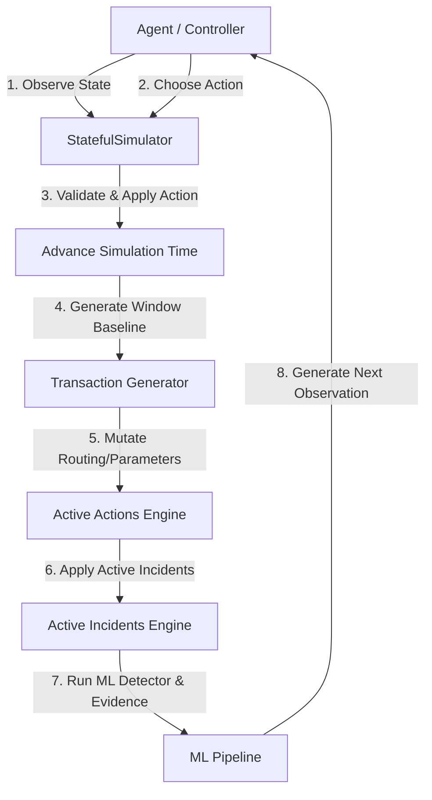

# Stateful Payment Recovery Simulator

This document provides a comprehensive overview of the design, interfaces, and mathematical simulation mechanics of the stateful recovery simulation environment.

---

## Architecture Overview

The simulator converts the current batch-oriented architecture into a stateful, interactive environment allowing step-by-step observation and control:



---

## 1. Simulation State Model

The simulator maintains an in-memory state object representing the status of the entire ecosystem:

*   `simulation_time` (datetime): The current timestamp.
*   `active_incidents` (list[str]): External IDs of active incidents during the step.
*   `gateway_health`, `bank_health`, `payment_method_health`, `merchant_health`, `regional_health` (dict[str, float]): Health indicator mapping (0.0 to 1.0 success rate profiles).
*   `transaction_count`, `success_count`, `failure_count`, `success_rate`, `failure_rate` (numerical aggregates).
*   `average_latency` (float): Average response times.
*   `revenue_at_risk` (Decimal): Aggregated ML-derived financial metrics.

---

## 2. API Interface

The controller/agent interacts with the simulator using the following three core functions:

### `reset() -> Observation`
Reinitializes the simulation time, seeds, active actions, and the baseline dataset iterator. Returns the initial observation payload.

### `step(action: dict | None) -> tuple[Observation, dict]`
Applies the recovery action (if provided and valid), advances simulation time by 5 minutes, generates a 5-minute batch of baseline transactions, mutates their routing/success outcomes based on active actions/incidents, evaluates outcomes via the ML detection model, and returns:
1.  **Observation**: Structured observation for agent decision making.
2.  **Outcome**: Numerical delta scoring (success rate improvement, latency recovery, revenue protection).

### `rollback_action(action_id: str) -> dict`
Deactivates a previously applied routing or parameter modification, restoring the default baseline routing rules.

---

## 3. Recovery Actions & Validation

Every action passed to `step` is subjected to validation before execution. Invalid actions are rejected with a descriptive reason.

### Action Types

#### 1. `ROUTE_TRAFFIC`
Reroutes a specified percentage of traffic matching specific criteria from a source gateway to a destination gateway.
```json
{
  "action_type": "ROUTE_TRAFFIC",
  "parameters": {
    "source_gateway": "gateway_beta",
    "destination_gateway": "gateway_alpha",
    "affected_bank": "HDFC Bank", // Optional
    "affected_payment_method": "UPI", // Optional
    "traffic_percentage": 100.0
  }
}
```

#### 2. `REDUCE_GATEWAY_TRAFFIC`
Decreases traffic directed to a target gateway, distributing it proportionally among other healthy gateways.
```json
{
  "action_type": "REDUCE_GATEWAY_TRAFFIC",
  "parameters": {
    "gateway": "gateway_beta",
    "traffic_percentage": 50.0
  }
}
```

#### 3. `DISABLE_PAYMENT_METHOD`
Temporarily disables a payment method, failing matching transactions immediately to prevent customer retry lag.
```json
{
  "action_type": "DISABLE_PAYMENT_METHOD",
  "parameters": {
    "payment_method": "CARD",
    "duration_minutes": 15
  }
}
```

#### 4. `RATE_LIMIT_MERCHANT`
Rejects a percentage of merchant requests to protect backend queue depth.
```json
{
  "action_type": "RATE_LIMIT_MERCHANT",
  "parameters": {
    "merchant": "merchant_retail_001",
    "traffic_percentage": 75.0
  }
}
```

---

## 4. Action Effects Mechanics

Unlike simple static models that overwrite global stats, the simulator mutates individual transaction records in-memory:

1.  **Rerouting**: The `gateway` property of the transaction is updated *before* the active incident evaluator runs.
2.  **Incident Avoidance**: Since incidents match transactions by their `gateway` property (e.g., `gateway_beta`), rerouted transactions bypass the active incident, naturally maintaining baseline healthy success and latency rates.

---

## 5. Rollback, Determinism & Reproducibility

-   **Rollback**: Removing an action deletes it from the active actions cache, restoring default baseline routing probabilities for subsequent steps.
-   **Determinism**: Running the simulator with the same seeds, inputs, and sequence of steps/actions yields identical transaction streams and metrics, verified through test automation.
-   **No Action Stability**: In the absence of actions and incidents, baseline transaction outcomes remain stable.
